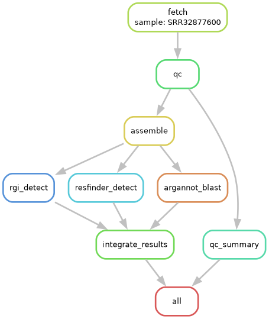

# AMR_Pipeline_Proto(prototype)

## Project Abstract
This pipeline is designed to automate the detection of Antimicrobial Resistance (AMR) genes from E. coli bacterial whole genome sequencing (WGS) data. It fetches raw reads, performs quality control(QC),
assembles trimmed reads with SPAdes and detect AMR genes with three separate tools, **RGI** (CARD database), **ResFinder**, and **ARG-ANNOT** (via BLAST)—in parallel. The result are then integrated into one
summary file. This pipeline is made with snakemake for reproducibility and scalability. 



## Dataset table 
| BioProject ID | Description | Link |
|---------------|-------------|------|
| PRJNA1100899 | Genomic analysis of E. coli isolated from passive surveillance of poultry at live bird markets in Dhaka, Bangladesh | https://www.ncbi.nlm.nih.gov/bioproject/PRJNA1100899 |
| PRJNA1222109 | Escherichia coli Raw sequence reads | https://www.ncbi.nlm.nih.gov/bioproject/PRJNA1222109 |

## Installation
1. Clone the repository:
``` bash  
git clone https://github.com/hasibulhossainsau-netizen/amr_pipeline_proto
cd amr_pipeline_proto 
```
2. Create the conda environments from the provided YAML files:
```
conda env create -f envs/amr_pipeline.yaml
conda env create -f envs/resfinder_env.yaml
conda env create -f envs/rgi_env.yaml 
```
3. Activate the main environment 
```
conda activate amr_pipeline
```
## Usage 
Dry Run(test the workflow logic)
```
snakemake --use-conda -n 
```
Run the pipeline with snakemake
```
snakemake --use-conda --cores 4 
```
To generate a DAG visualization of the workflow 
```
snakemake --dag | dot -Tpng > dag.png 
```
## Citation and Tool references 
1. RGI (Resetance Gene Identifier) - Alcock, B. P., Huynh, W., Chalil, R., Smith, K. W., Raphenya, A. R., Wlodarski, M. A., Edalatmand, A., Petkau, A., Syed, S. A., Tsang, K. K., Baker, S. J. C., Dave, M., McCarthy, M. C., Mukiri, K. M., Nasir, J. A., Golbon, B., Imtiaz, H., Jiang, X., Kaur, K., Kwong, M., … McArthur, A. G. (2023). CARD 2023: expanded curation, support for machine learning, and resistome prediction at the Comprehensive Antibiotic Resistance Database. Nucleic acids research, 51(D1), D690–D699. https://doi.org/10.1093/nar/gkac920
2. ResFinder - Bortolaia, V., Kaas, R. S., Ruppe, E., Roberts, M. C., Schwarz, S., Cattoir, V., Philippon, A., Allesoe, R. L., Rebelo, A. R., Florensa, A. F., Fagelhauer, L., Chakraborty, T., Neumann, B., Werner, G., Bender, J. K., Stingl, K., Nguyen, M., Coppens, J., Xavier, B. B., Malhotra-Kumar, S., … Aarestrup, F. M. (2020). ResFinder 4.0 for predictions of phenotypes from genotypes. The Journal of antimicrobial chemotherapy, 75(12), 3491–3500. https://doi.org/10.1093/jac/dkaa345
3. ARG-ANNOT - Gupta, S. K., Padmanabhan, B. R., Diene, S. M., Lopez-Rojas, R., Kempf, M., Landraud, L., & Rolain, J. M. (2014). ARG-ANNOT, a new bioinformatic tool to discover antibiotic resistance genes in bacterial genomes. Antimicrobial agents and chemotherapy, 58(1), 212–220. https://doi.org/10.1128/AAC.01310-13
4. Snakemake -  Mölder F, Jablonski KP, Letcher B et al. Sustainable data analysis with Snakemake [version 1; peer review: 1 approved, 1 approved with reservations]. F1000Research 2021, 10:33 (https://doi.org/10.12688/f1000research.29032.1) 
5. SPAdes - Prjibelski, A., Antipov, D., Meleshko, D., Lapidus, A., & Korobeynikov, A. (2020). Using SPAdes de novo assembler. Current Protocols in Bioinformatics, 70, e102. doi: 10.1002/cpbi.102
## Licence 
This project is licensed under the MIT License. See the LICENSE file for details. 
